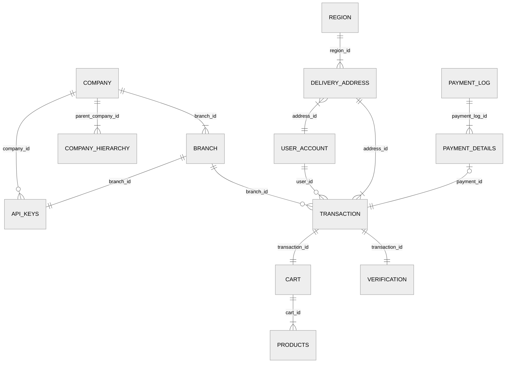
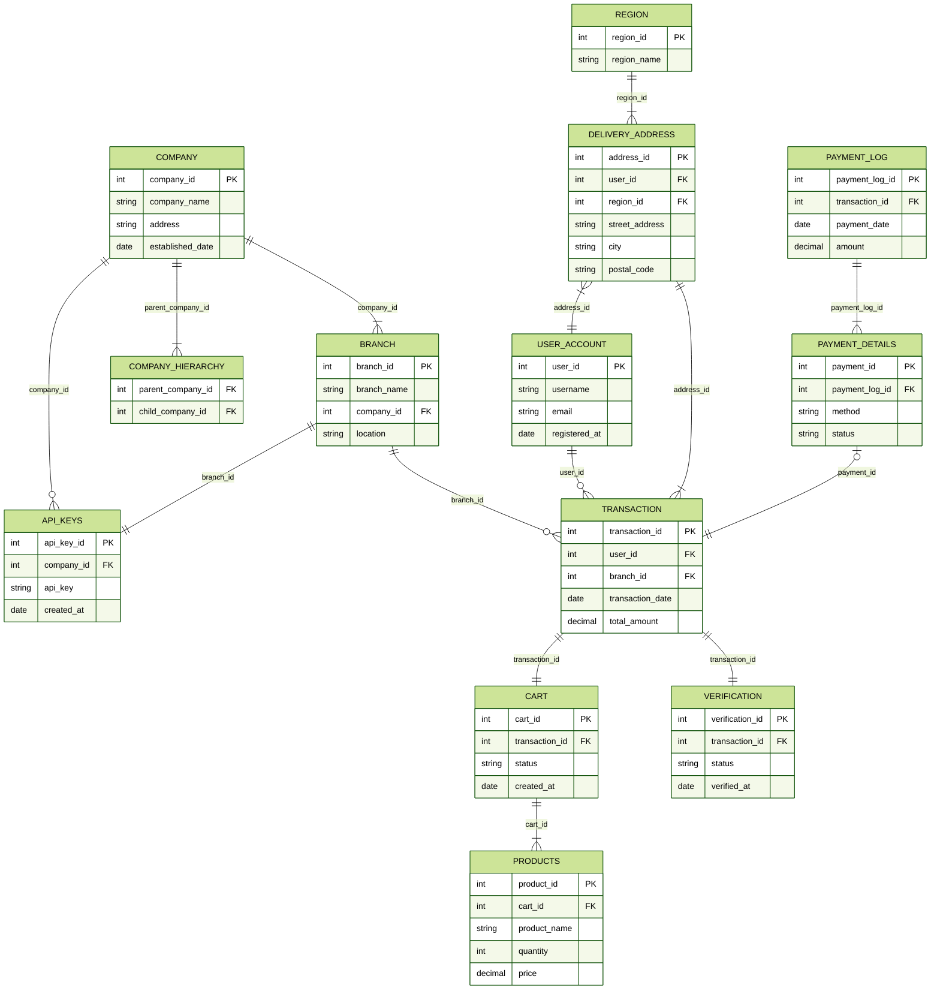

# ER図

ER図のサンプルです。  
※中身は架空のモノです。

---

### 鳥瞰データモデル図



#### コード

```
%%{init:{'theme':'neutral'}}%%
erDiagram
    COMPANY ||--|{ BRANCH : branch_id
    COMPANY ||--o{ API_KEYS : company_id
    COMPANY ||--|{ COMPANY_HIERARCHY : parent_company_id
    TRANSACTION ||--|| CART: transaction_id
    BRANCH ||--o{ TRANSACTION: branch_id
    BRANCH ||--|| API_KEYS: branch_id
    USER_ACCOUNT ||--o{ TRANSACTION: user_id
    REGION ||--|{ DELIVERY_ADDRESS: region_id
    DELIVERY_ADDRESS }|--|| USER_ACCOUNT: address_id
    DELIVERY_ADDRESS ||--|{ TRANSACTION: address_id
    CART ||--|{ PRODUCTS: cart_id
    PAYMENT_LOG ||--|{ PAYMENT_DETAILS: payment_log_id
    PAYMENT_DETAILS |o--|| TRANSACTION : payment_id
    TRANSACTION ||--|| VERIFICATION: transaction_id
```

---

### ER図



#### コード

```
%%{init:{'theme':'forest'}}%%
erDiagram
    COMPANY ||--|{ BRANCH : company_id
    COMPANY ||--o{ API_KEYS : company_id
    COMPANY ||--|{ COMPANY_HIERARCHY : parent_company_id
    TRANSACTION ||--|| CART: transaction_id
    BRANCH ||--o{ TRANSACTION: branch_id
    BRANCH ||--|| API_KEYS: branch_id
    USER_ACCOUNT ||--o{ TRANSACTION: user_id
    REGION ||--|{ DELIVERY_ADDRESS: region_id
    DELIVERY_ADDRESS }|--|| USER_ACCOUNT: address_id
    DELIVERY_ADDRESS ||--|{ TRANSACTION: address_id
    CART ||--|{ PRODUCTS: cart_id
    PAYMENT_LOG ||--|{ PAYMENT_DETAILS: payment_log_id
    PAYMENT_DETAILS |o--|| TRANSACTION : payment_id
    TRANSACTION ||--|| VERIFICATION: transaction_id
    COMPANY {
        int company_id PK
        string company_name
        string address
        date established_date
    }
    BRANCH {
        int branch_id PK
        string branch_name
        int company_id FK
        string location
    }
    API_KEYS {
        int api_key_id PK
        int company_id FK
        string api_key
        date created_at
    }
    COMPANY_HIERARCHY {
        int parent_company_id FK
        int child_company_id FK
    }
    TRANSACTION {
        int transaction_id PK
        int user_id FK
        int branch_id FK
        date transaction_date
        decimal total_amount
    }
    CART {
        int cart_id PK
        int transaction_id FK
        string status
        date created_at
    }
    PRODUCTS {
        int product_id PK
        int cart_id FK
        string product_name
        int quantity
        decimal price
    }
    USER_ACCOUNT {
        int user_id PK
        string username
        string email
        date registered_at
    }
    REGION {
        int region_id PK
        string region_name
    }
    DELIVERY_ADDRESS {
        int address_id PK
        int user_id FK
        int region_id FK
        string street_address
        string city
        string postal_code
    }
    PAYMENT_LOG {
        int payment_log_id PK
        int transaction_id FK
        date payment_date
        decimal amount
    }
    PAYMENT_DETAILS {
        int payment_id PK
        int payment_log_id FK
        string method
        string status
    }
    VERIFICATION {
        int verification_id PK
        int transaction_id FK
        string status
        date verified_at
    }
```
