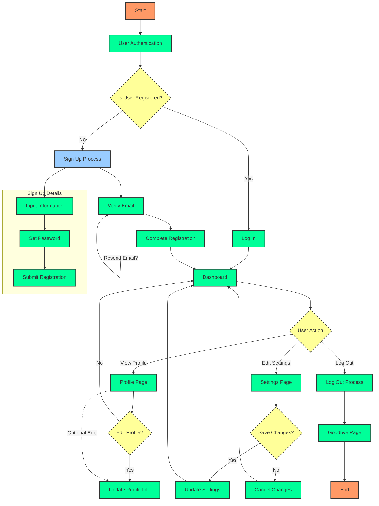

# フローチャート図

フローチャート図のサンプルです。  
※中身は架空のモノです。

---



#### コード

```
%%{init: {"flowchart": {"htmlLabels": false}} }%%
flowchart TD
    classDef start_end fill:#f96,stroke:#333,stroke-width:2px;
    classDef process fill:#0f9,stroke:#333,stroke-width:2px;
    classDef decision fill:#ff9,stroke:#333,stroke-width:2px,stroke-dasharray: 5 5;
    classDef subprocess fill:#9cf,stroke:#333,stroke-width:2px;

    A[Start]:::start_end --> B[User Authentication]:::process
    B --> C{Is User Registered?}:::decision
    C -->|Yes| D[Log In]:::process
    C -->|No| E[Sign Up Process]:::subprocess
    E --> F[Verify Email]:::process
    F --> G[Complete Registration]:::process

    D & G --> H[Dashboard]:::process

    H --> I{User Action}:::decision
    I -->|View Profile| J[Profile Page]:::process
    I -->|Edit Settings| K[Settings Page]:::process
    I -->|Log Out| L[Log Out Process]:::process

    K --> M{Save Changes?}:::decision
    M -->|Yes| N[Update Settings]:::process
    M -->|No| O[Cancel Changes]:::process
    N & O --> H

    J --> P{Edit Profile?}:::decision
    P -->|Yes| Q[Update Profile Info]:::process
    P -->|No| H

    L --> R[Goodbye Page]:::process
    R --> S[End]:::start_end

    subgraph Sign Up Details
        E1[Input Information]:::process --> E2[Set Password]:::process
        E2 --> E3[Submit Registration]:::process
    end
    E --> E1

    J -.->|Optional Edit| Q
    F -->|Resend Email?| F

```
