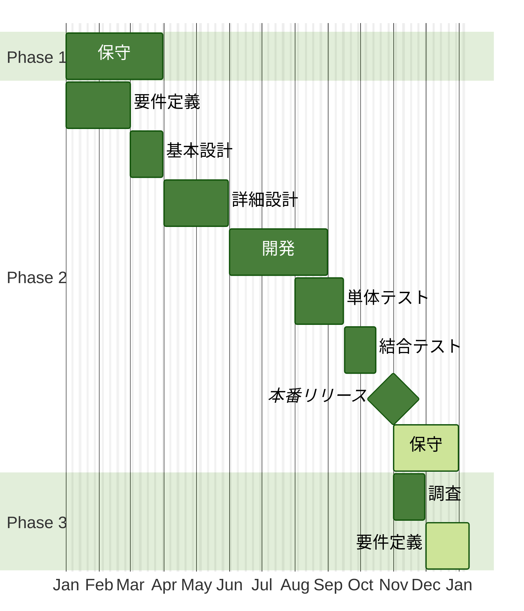
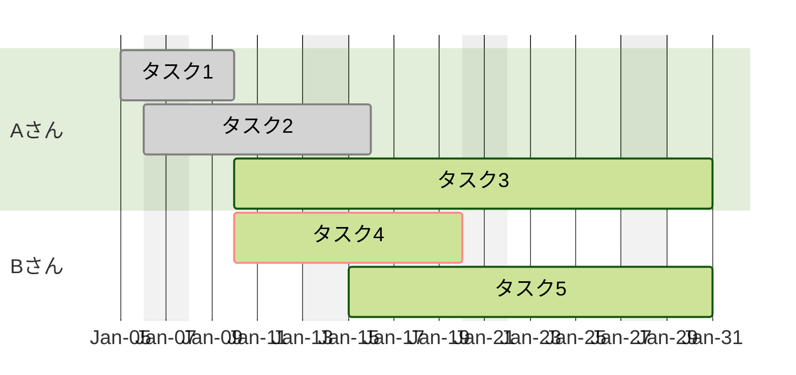

# ガントチャート図

ガントチャートのサンプルです。  
※中身は架空のモノです。

---

### 年のチャート



#### コード

```
%%{
  init: {
    'theme': 'forest',
    'themeCSS':"text { font-size: 25px !important; }",
    'gantt': { 'barHeight': 70, 'leftPadding': 100 }
  }
}%% 
gantt
    dateFormat YYYY-MM-DD
    excludes weekends
    axisFormat %b

    section Phase 1
    保守: ph1_1, 2024-01-01, 2024-03-31

    section Phase 2
    要件定義: ph2_1, 2024-01-01, 2024-03-01
    基本設計: ph2_2, 2024-03-01, 2024-03-31
    詳細設計: ph2_3, 2024-04-01, 2024-05-31
    開発: ph2_4, 2024-06-01, 2024-08-31
    単体テスト: ph2_5, 2024-08-01, 2024-09-15
    結合テスト: ph2_6, 2024-09-16, 2024-10-15
    本番リリース:milestone, ph2_7, 2024-10-31, 1d
    保守: active, ph2_8, after ph2_7, 2024-12-31

    section Phase 3
    調査: ph3_1, 2024-11-01, 2024-11-30
    要件定義: active, ph3_2, 2024-12-01, 30d
```


---

### 月のチャート



#### コード

```
%%{
  init: {
    'theme': 'forest',
    'themeCSS':"text { font-size: 20px !important; }",
    'gantt': { 'barHeight': 50, 'leftPadding': 120 }
  }
}%% 
gantt
    dateFormat YYYY-MM-DD
    excludes weekends
    axisFormat %b-%d

    section Aさん
    タスク1: done, task1, 2024-01-05, 2024-01-10
    タスク2: done, task2, 2024-01-06, 2024-01-16
    タスク3: active, task3, 2024-01-10, 2024-01-31

    section Bさん
    タスク4: crit, active, task1, 2024-01-10, 2024-01-20
    タスク5: active, task2, 2024-01-15, 2024-01-31
```
