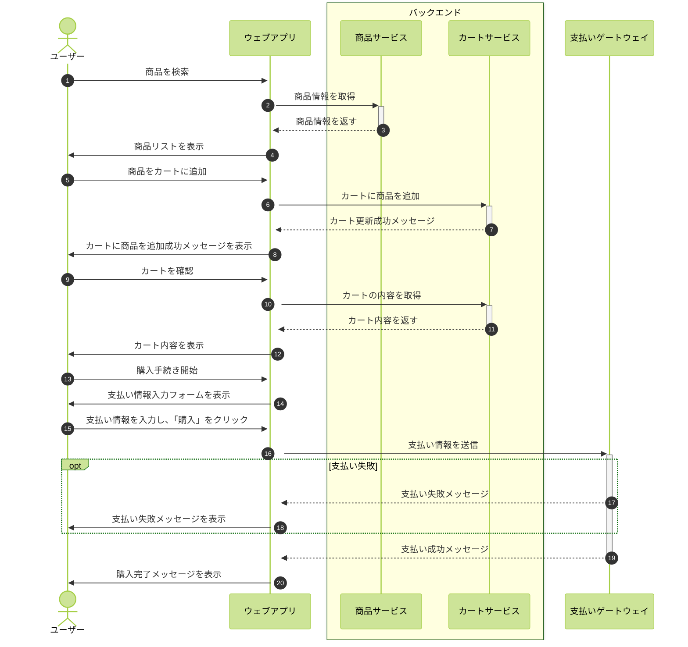

# シーケンス図

シーケンス図のサンプルです。  
※中身は架空のモノです。

---

```mermaid
%%{
  init: {
    'theme': 'forest',
    'themeVariables': {
      'background': '#fff',
      'labelBoxBorderColor': '#006400'
    }
  }
}%%
sequenceDiagram
autonumber %%
    actor User as ユーザー
    participant WebApp as ウェブアプリ
    box lightyellow バックエンド
      participant ProductService as 商品サービス
      participant CartService as カートサービス
    end
    participant PaymentGateway as 支払いゲートウェイ

    User ->>+ WebApp: 商品を検索
    WebApp ->>+ ProductService: 商品情報を取得
    ProductService -->>- WebApp: 商品情報を返す
    WebApp ->> User: 商品リストを表示

    User ->>+ WebApp: 商品をカートに追加
    WebApp ->>+ CartService: カートに商品を追加
    CartService -->>- WebApp: カート更新成功メッセージ
    WebApp ->> User: カートに商品を追加成功メッセージを表示

    User ->>+ WebApp: カートを確認
    WebApp ->>+ CartService: カートの内容を取得
    CartService -->>- WebApp: カート内容を返す
    WebApp ->> User: カート内容を表示

    User ->>+ WebApp: 購入手続き開始
    WebApp ->> User: 支払い情報入力フォームを表示
    User ->> WebApp: 支払い情報を入力し、「購入」をクリック
    WebApp ->>+ PaymentGateway: 支払い情報を送信
    opt 支払い失敗
        PaymentGateway -->> WebApp: 支払い失敗メッセージ
        WebApp ->> User: 支払い失敗メッセージを表示
    end
    PaymentGateway -->>- WebApp: 支払い成功メッセージ
    WebApp ->> User: 購入完了メッセージを表示
```
