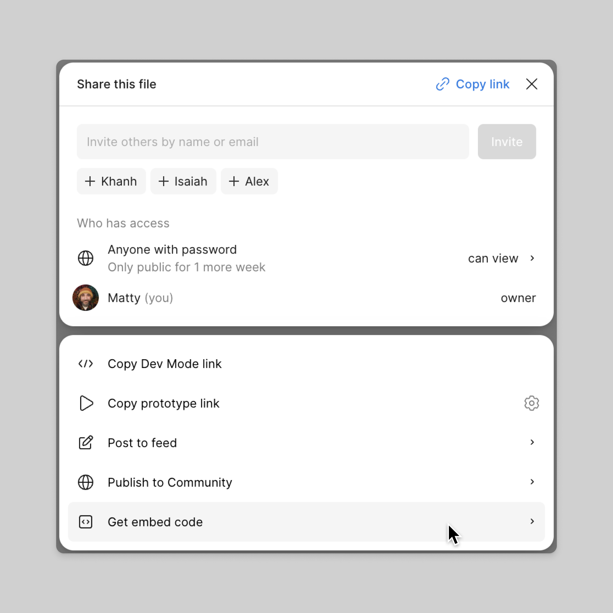
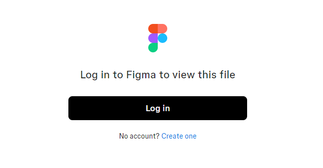

# Figma埋め込み

Figmaの埋め込み機能を使用すれば、ドキュメントサイト内で特定のFigmaコンポーネントを閲覧することができます。\
Figmaのデザインが更新されると、自動的に埋め込んだiframeも更新されます。

埋め込み方法を記載します。

---

1. Figmaを開きます。

2. インポートしたいコンポーネントをクリックし、右上の「Share」ボタンを押下します。

3. 「Get embed code」を選択します。

4. 「Copy」ボタンを押下します。

5. Markdownにコピーしたiframeを貼り付けます。

6. Docusaurusを立ち上げ、Figmaコンポーネントが正しく表示されることを確認してください。

:::note

Figmaでのアクセス権限が有効になっているため、アクセス権限のないアカウントから埋め込んだページを閲覧すると下記のようにログインするように求められます。

:::
