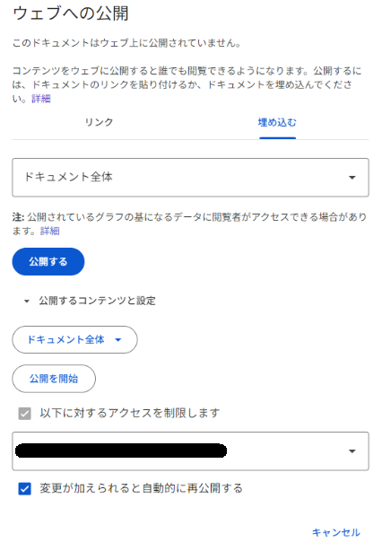
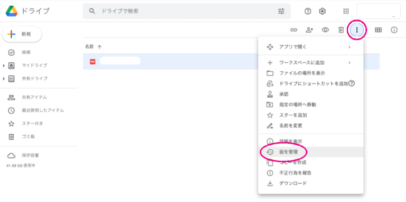

# GoogleDriveのファイル埋め込み

Google SheetやGoogle Slideの埋め込み機能を使用すれば、ドキュメントサイト内でこれらのファイルを閲覧することができます。

埋め込み方法や注意点などを記載します。

---

## 埋め込み方法

### Google Sheet

1. GoogleDriveから埋め込みたいGoogle Sheetを開きます。

2. 「ファイル > 共有 > ウェブ公開」を選択します。

3. 「埋め込む」タブを選択します。

4. 埋め込みたいシートを選択します。

5. 🚫(重要) 一般公開してはいけないファイルを埋め込みたい場合には、コンテンツのアクセス制限がされていることを必ず確認してください。

6. 「公開」を押下します。確認ポップアップが表示されるので「OK」を押下します。

7. iframeタグが表示されるので、コピーして埋め込みたい記事にペーストしてください。

:::tip

- サイズは「width」と「height」で調整できます。
- 「src」属性もカスタマイズできます。
  - `&amp;range=A1:D9`のように記載すれば、A1:D9の範囲のみを埋め込みできます。
  - `&amp;headers=true`のように記載すれば、行・列の番号を表示できます。
  - `&amp;chrome=false`のように記載すれば、タイトルとフッターを非表示にできます。

:::

:::note

GoogleDriveでのアクセス権限が有効になっているため、アクセス権限のないアカウントから埋め込んだページを閲覧すると下記のようにログインするように求められます。

:::

---

### Google Slide

1. GoogleDriveから埋め込みたいGoogle Slideを開きます。

2. 「ファイル > 共有 > ウェブ公開」を選択します。

3. 「埋め込む」タブを選択します。

4. スライドのサイズを変更できます。\
   ここで変更しなくてもあとで指定することもできます。

5. 「プレーヤーの読み込み後すぶにスライドショーを開始する」はチェックしないようにお願いします。

6. 🚫(重要) 一般公開してはいけないファイルを埋め込みたい場合には、コンテンツのアクセス制限がされていることを必ず確認してください。

7. 「公開」を押下します。確認ポップアップが表示されるので「OK」を押下します。

8. iframeタグが表示されるので、コピーして埋め込みたい記事にペーストしてください。

:::note

GoogleDriveでのアクセス権限が有効になっているため、アクセス権限のないアカウントから埋め込んだページを閲覧すると下記のようにログインするように求められます。

:::

---

### 更新時の注意点

Excel ⇔ Google Sheetの互換性の不具合が発生する可能性があるため、Excelファイルの更新を行う際には「ダウンロード」から一度ローカルにファイルを追加してから更新することをおススメします。

更新したファイルは、下図の「版を管理」からアップロードすることで、バージョン管理することができます。

