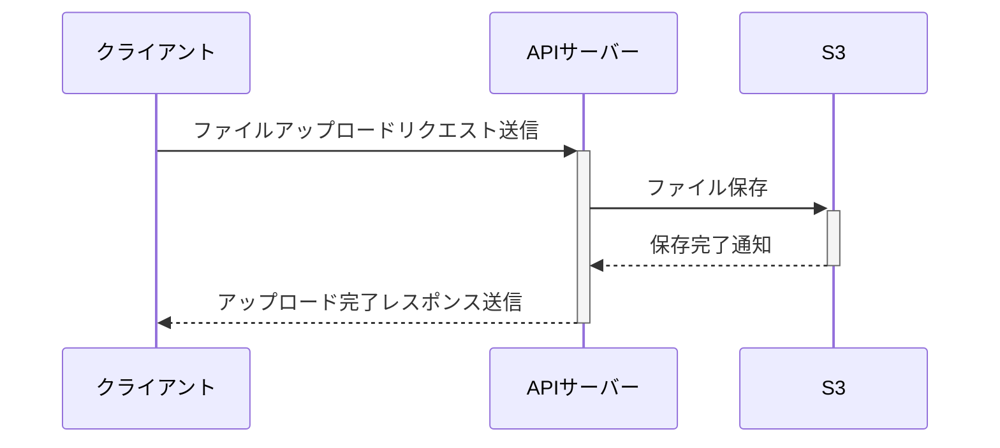

# ドキュメントの書き方

## はじめに

本ガイドでは、分かりやすい仕様書や説明資料を作成するためのポイントをまとめています。　　
読者のニーズに応じた適切なドキュメントを作成することで、情報共有の効率化やプロジェクトの生産性向上を目指します。

### 目的

- **誰にでも理解しやすいドキュメント**を作成する。
- **仕様や背景を明確に伝える**ことで、コミュニケーションコストを削減する。
- チームやプロジェクトの属人性を減らし、スムーズな引き継ぎを可能にする。

### ドキュメント作成の意義

- **情報共有の促進**: チームメンバー全員が同じ情報を共有できる。
- **作業効率の向上**: 書かれている内容を参照するだけでタスクに取り掛かれる。
- **知識の資産化**: プロジェクトにおける知識やノウハウを文書として残す。
- **問い合わせの削減**: 内容が明確であれば、追加説明の必要性が減少する。
  - 参考）[ドキュメントを書かないことは「負債を生む」ということ](https://qiita.com/hiramax/items/213bd58837b39411fc06)

---

## ドキュメント作成の基本原則

### 1. 誰が読むかを意識する

最初に、対象読者を明確にしましょう。読者の知識レベルや目的に合わせて内容を調整します。

#### 読者の例

- **エンジニア向け**: 技術的な詳細を重視し、専門用語を使用。
- **営業や管理者向け**: 高度な技術用語を避け、全体像や成果にフォーカス。
- **クライアント向け**: 用語を簡潔に説明し、結果を分かりやすく伝える。

#### 方法

- **読者層を明記**:
  - `対象読者: サーバーサイドエンジニア`
  - `対象読者: Google Analyticsを利用したことがあるマーケター`
- **必要な前提知識を定義**:
  - `前提知識: 高校数学レベルの確率統計`

---

### 2. 明確な言葉を使う

#### ポイント

- **未知の用語を説明する**: 読者が知らない可能性がある言葉は必ず定義。
- **用語を統一**: 同じ概念を複数の表現で書かない。
- **文法や表現の一貫性**: 語尾や句読点を揃える。

#### 例

- **悪い例**:
  - `KPIとはKey Performance Indicatorの略です。`
- **良い例**:
  - `KPI (Key Performance Indicator) とは、目標の達成度合いを測るための定量的指標です。例えば、「売上を10%増加させる」場合、売上高がKPIになります。`

---

### 3. 具体性を重視する

抽象的な表現は避け、可能な限り具体的に書きます。

#### 例

- **悪い例**: `データベースの障害が発生しています。`
- **良い例**: `2024年3月12日13時30分頃から、ユーザーテーブルに関連するクエリ実行でタイムアウトが頻発しています。原因はインデックスが正しく適用されていないためと推測されます。`

---

### 4. 適切な表現形式を選ぶ

内容に応じて、文章・箇条書き・表・図表を使い分けます。

#### 例

- **文章形式**:
  - `ファイルのアップロードは、まずクライアントが API サーバーにリクエストを送信し、その後 AWS S3 バケットに保存されます。`
- **図形式**:
  - リクエストフローを示す図を追加することで、視覚的に理解を促進。

---

### 5. フォーマットを統一する

一貫性のあるフォーマットは読みやすさに直結します。

#### 注意点

- **フォントとスタイル**: 固定幅フォントとプロポーショナルフォントを使い分け。
- **英数字の全角半角**: 数値やコードは半角、文章内の一般的な記述は全角。
- **見出しと段落構成**: 階層を明確にして整理。

#### 例

- **悪い例**:
  - `Microsoft の開発した ＯＳ であるWindowsは普及しました.`
- **良い例**:
  - `Microsoftが開発したOS (Operating System) である Windows は、Windows 95以降広く普及しました。`

---

## ドキュメント管理のポイント

### 1. 一元管理

プロジェクトに関連する全ての資料を一つの場所に集約します。

- **方法**: Google DocsやGitHubリポジトリを活用。
- **メリット**: 必要な資料を素早く探せる。

### 2. バージョン管理

変更履歴を残すことで、誰がどのように修正を加えたかを追跡可能にします。

#### 方法

- **ツール**: GitやGoogle Docsのバージョン履歴機能。

### 3. メンテナンス性の向上

#### ポイント

- **自動生成ツールの活用**:
  - OpenAPIからAPIドキュメントを生成。
  - ER図をデータベースから自動生成。
- **更新作業の簡易化**:
  - 明確なドキュメント構造を維持する。
  - 必要な箇所がすぐに見つかるリンク構造を作成。

---

ドキュメントはただ作成するだけでなく、**利用されることを前提**として設計することが重要です。\
こちらを参考に、チームやプロジェクトに貢献できるドキュメントを作成してください。
